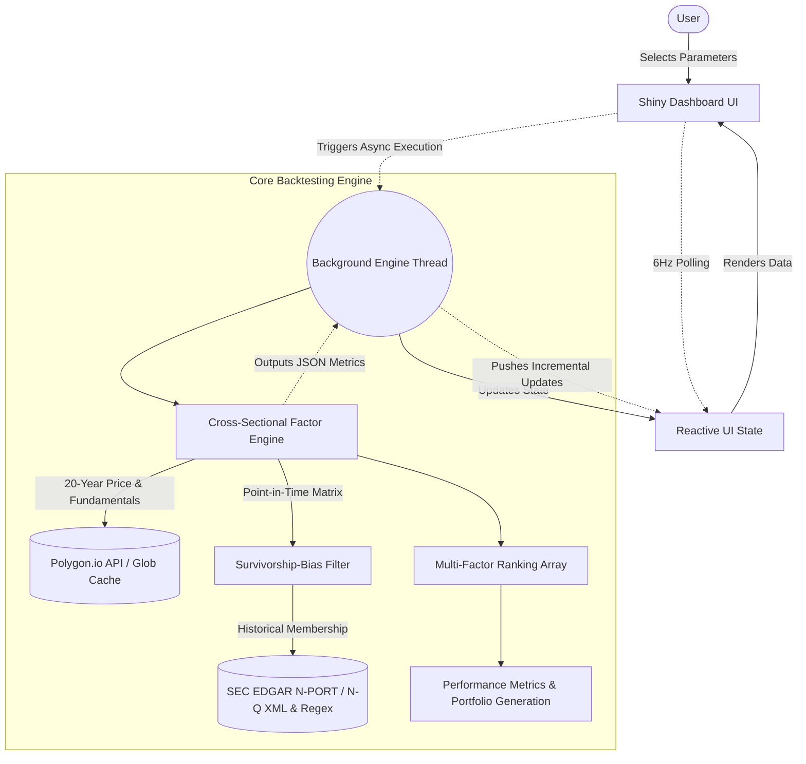

# Factor Workbench: Quantitative Backtesting Engine


Factor Workbench is an institutional-grade, asynchronous quantitative backtesting dashboard built with **Shiny for Python**. It empowers users to simulate cross-sectional multi-factor equity strategies across major indices (Russell 2000, S&P 500, Nasdaq 100). The system autonomously generates analytical hypotheses, processes historical data, and evaluates portfolio risk natively in a highly concurrent environment.

---

## System Architecture

The application seamlessly decouples heavy quantitative workloads from the front-end user interface using robust background execution threads and real-time polling to prevent UI freezing during 20-year multi-index parameter evolutions.



---

## Key Features

1. **Fundamental and Technical Factor Availability**:
    The system is pre-configured and capable of mutating a vast array of both technical and fundamental boundaries natively:
    - **Fundamental Factors**: Directly evaluates SEC core metrics including Earnings Per Share (EPS), Revenues, Total Equity, Price-to-Earnings Ratio (PE), Price-to-Book (PB), and Price-to-Sales (PS).
    - **Technical Factors**: Deep mathematical derivations measuring Momentum profiles, Mean-Reversion, 20-day Volatility, Volume metrics, and Firm Size.
    - **Indicator Generators**: Capable of dynamically spinning up Simple Moving Averages (SMA), Moving Average Convergence Divergence (MACD), and Relative Strength Indexes (RSI) across custom generational intervals natively.

2. **Institutional Data Integrity (constituents/)**:
    - Avoids survivorship bias by deploying a dynamic **Point-In-Time (PIT)** filter across multi-decade evaluation bounds.
    - A dedicated multi-index SEC EDGAR traversal pipeline natively scrapes historical CUSIP registries. It perfectly resolves structural proxy holdings for IWM (Russell 2000), IVV (S&P 500), and QQQ (Nasdaq 100) back to 2006.
    - Employs advanced fallback routing mapping unstructured, legacy HTML N-Q and N-CSR filings algorithmically executing strict 9-character CUSIP Regex extractors for deep-history traversals natively missing from modern XML arrays.

3. **Genetic Alpha Miner (factor_miner.py)**:
    - Deploys Symbolic Regression via `gplearn` to autonomously evolve custom, non-linear analytical alpha formulas evaluating rolling price technicals and fundamental metrics synchronously.
    - **Fundamental Hybridization**: The matrix pool acts as a multi-dimensional solver, deeply injecting 20-year fundamental SEC variables explicitly matched into evolutionary parameters natively alongside technical bounds.
    - **Algorithmic Expansion**: Allows dynamic routing directly targeting custom, high-performance C-level Numpy vector fitness constraints tracking **Sharpe Ratio** and **Calmar Ratio/Information Coefficients**, bypassing standard matrix padding. It employs strictly absolute Numpy infinity/NaN zero-masks, systematically preventing unadjusted stock split bounds from crashing PyGP matrices.
    - **Theoretical Syntax Sets**: Exposes granular parameter control dictating exact structural capabilities to the execution logic (e.g. Linear Arithmetic, Cross-Sectional Scoring, Time-Series Momentum arrays).
    - Features strict **Parsimony Penalties** avoiding massive hallucinatory curve-fitting nested trees.

4. **High-Performance Backtest Engine (tools.py)**:
    - Fully vectorized multi-factor arrays evaluating constraints natively over the entire cross-section.
    - Dynamic benchmark mapping ensures strategy parameters are cleanly isolated and tracked accurately against their true proxy ETF baseline.

5. **Responsive UI & Threading**:
    - Custom dark-theme aesthetics with dynamic Bootstrap 5 CSS mapping.
    - Completely asynchronous quantitative loops utilizing native Python Threading.
    - Embedded UI Modals provide granular, smooth, sub-second percentage loader sweeps, eliminating browser locks entirely.

---

## Installation & Setup

1. **Clone & Virtual Environment Configuration**:
    ```bash
    git clone https://github.com/datik01/factor_workbench_alpha.git
    cd factor_workbench_alpha
    python3 -m venv venv
    source venv/bin/activate
    ```

2. **Install Associated Dependencies**:
    ```bash
    pip install -r requirements.txt
    ```
    *Ensure you have shiny, pandas, numpy, plotly, requests, and beautifulsoup4.*

3. **Provide API Tokens**:
    In your local root .env file, export your required API key to handle the caching and mapping backend:
    ```bash
    MASSIVE_API_KEY="your_massive_key_here"
    ```
    *The MASSIVE_API_KEY is fully required for executing the cold-start Cache Rebuild fallback which structurally maps dynamic SEC EDGAR CUSIPs into exact Tickers point-in-time.*

4. **(Optional) Bypass API Limits via Cache**:
    To avoid downloading 20+ years of data per ticker locally, you can download the `factor_cache_v2.zip` database directly from the Releases tab on this Github repository. 
    ```bash
    unzip factor_cache_v2.zip -d .
    ```
    *Note: If you clone the repository entirely empty and skip downloading the cache, the application will safely catch the Missing Data constraint dynamically. Instead of crashing, it will spawn an automatic Cold Start Handler locally extracting point-in-time assets directly from SEC EDGAR proxies spanning 20 years natively across S&P 500/R2K and Nasdaq. It evaluates and intelligently overrides persistent wildcard parquet caches automatically inside the physical .cache/ footprint.*

5. **Initialize application**:
    ```bash
    shiny run --reload app.py
    ```

## Testing Protocol

The platform explicitly tests mathematical mapping integrations utilizing unittest.mock. 
Run the integrated test suite locally utilizing:
```bash
python3 -m unittest tests/test_engine.py
```
This rapidly simulates execution paths, explicitly testing scaling nodes, nonlocal backend thread bindings, and structural matrix alignment validating exact mappings between the baseline Index APIs and the backtest framework. 

---

*Disclaimers: Data points utilized within this system are structured purely for research and educational implementations mirroring systemic algorithms in systemic markets.*
