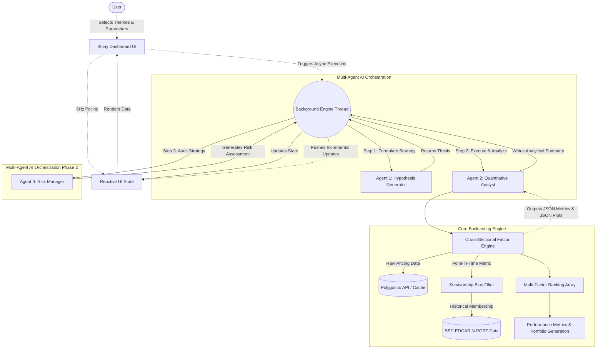

# 📈 Factor Workbench: AI-Orchestrated Quantitative Backtesting


Factor Workbench is an institutional-grade, asynchronous quantitative backtesting dashboard built with **Shiny for Python**. It empowers users to simulate cross-sectional multi-factor equity strategies across major indices (Russell 2000, S&P 500, Nasdaq 100) and leverages a **local Multi-Agent AI (Ollama)** architecture to autonomously generate hypotheses, analyze performance, and evaluate portfolio risk.

---

## 🏛️ System Architecture

The application seamlessly decouples heavy quantitative workloads and AI inference from the front-end user interface using a robust background execution thread and real-time polling. 



---

## ✨ Key Features

1. **Multi-Agent Orchestration (`agents.py`)**:
    - **Hypothesis Generator**: Formulates an initial market thesis based on selected parameters (e.g., Value + Momentum).
    - **Quant Analyst**: Programmatically interfaces with the backtest tool (`tools.py`), executing the strategy and translating the raw JSON metrics into a readable performance report.
    - **Risk Manager**: Critiques the Quant Analyst's report, summarizing structural drawdowns and assessing the validity of the strategy constraint variables.

2. **Institutional Data Integrity (`constituents/`)**:
    - Avoids survivorship bias by deploying a dynamic **Point-In-Time (PIT)** filter.
    - A dedicated SEC EDGAR N-PORT parser natively scrapes the historical holdings of proxies like `IWM` (Russell 2000) or `SPY` (S&P 500) to ensure the engine only targets assets exactly as they existed on the historical rebalance date.

3. **High-Performance Backtest Engine (`tools.py`)**:
    - Fully vectorized multi-factor arrays evaluating Momentum, Mean Reversion, Volatility, Volume profiles, and Size.
    - Dynamic benchmark mapping ensures strategy parameters are cleanly isolated and tracked accurately against their true proxy ETF baseline.

4. **Responsive UI & Threading**:
    - Custom dark-theme aesthetics with dynamic Bootstrap 5 CSS mapping.
    - Completely asynchronous quantitative loops utilizing native Python Threading.
    - Embedded UI Modals provide granular, smooth, sub-second (Zeno-asymptotic) percentage loader sweeps, eliminating browser locks entirely.

---

## 🚀 Installation & Setup

1. **Clone & Virtual Environment Configuration**:
    ```bash
    git clone https://github.com/datik01/factor_workbench.git
    cd factor_workbench
    python3 -m venv venv
    source venv/bin/activate
    ```

2. **Install Associated Dependencies**:
    ```bash
    pip install -r requirements.txt
    ```
    *Ensure you have `shiny`, `pandas`, `numpy`, `plotly`, `requests`, and `beautifulsoup4`.*

3. **Provide API Tokens**:
    In your local root `.env` file, export your required API key to handle the caching and mapping backend:
    ```bash
    MASSIVE_API_KEY="your_massive_key_here"
    ```
    *The `MASSIVE_API_KEY` is fully required for executing the cold-start Cache Rebuild fallback which structurally maps dynamic SEC EDGAR CUSIPs into exact Tickers point-in-time.*

4. **Run the AI Local Node**:
    The system relies entirely on local, private inference via Ollama. Ensure your Ollama node is actively hosting the defined model (e.g., Gemma).
    ```bash
    ollama serve
    ```

5. **(Optional) Bypass API Limits via Cache**:
    To avoid downloading 4+ years of data per ticker locally, you can download the `factor_cache_v1.zip` database directly from the **Releases** tab on this Github repository. 
    ```bash
    unzip factor_cache_v1.zip -d .
    ```
    *Note: If you clone the repository entirely empty and skip downloading the cache, the application will safely catch the Missing Data constraint dynamically. Instead of crashing, it will spawn an automatic "Cold Start Handler" locally extracting point-in-time assets directly from SEC EDGAR XMLs mapped by the Massive API. This fallback takes ~5-10 minutes.*

6. **Initialize application**:
    ```bash
    shiny run --reload app.py
    ```

---

## 💼 Business Value for Stakeholders
*(📝 TODO: Write 3-5 paragraphs here. Explain who your stakeholders are (e.g. Quant Portfolio Managers, Retail Traders) and exactly how the 3 AI agents and algorithmic backtesting tool directly solve their pain points or save them time. Example starting point: Quantitative Portfolio Managers traditionally spend weeks manually querying EDGAR databases, constructing point-in-time survivorship bias filtration maps, and running cross-sectional statistical limits to discover actionable market anomalies. This tool leverages asynchronous LLMs to compress that timeframe from weeks to under 30 seconds...)*

---

## 🔧 AI Agent Tool Parameters (Function Calling)
The Quantitative Analyst Agent autonomously calls the `run_cross_sectional_backtest` tool dynamically. Below are the exact structural constraints and parameters it processes:

| Parameter Name | Data Type | Purpose & Impact |
| --- | --- | --- |
| `tickers` | `list` | Active constituents representing the specific target universe (R2K, S&P 500, or NDX) scraped dynamically from the UI parameters. |
| `themes` | `list` | Selected macro-factor tilts (e.g., *Momentum*, *Value*, *Volatility*) defining the algorithmic cross-sectional rank evaluations. |
| `portfolio_size` | `int` | Dictates absolute cutoffs for asset inclusion (defining the size of the long/short basket portfolios). |
| `strategy_type` | `str` | Sets matrix constraints defining the long-only vs long/short equity algorithmic bounds. |
| `start_year`/`end_year` | `int` | Chronological bounding limits isolating the test across specific macroeconomic regimes. | 

**Returns**: The tool generates a structured exact `dict` payload holding aggregated compound annual returns, drawdown maps, symmetric Index benchmark calculations (Sharpe Ratio), and the Plotly visualization coordinates, returning it straight into the Ollama Quant Agent for readable synthesis.

---

## 👥 Team Members (Roles)
- **Daniel Atik** - *Project Manager & Full Stack Developer*
- **Masaab** - 

---

## 🧪 Testing Protocol

The platform explicitly tests mathematical mapping integrations utilizing `unittest.mock`. 
Run the integrated test suite locally utilizing:
```bash
python3 -m unittest tests/test_engine.py
```
This rapidly simulates execution paths, explicitly testing scaling nodes, `nonlocal` backend thread bindings, and structural matrix alignment (Sharpe, Returns) validating exact mappings between the baseline Index APIs and the backtest framework. 

---

*Disclaimers: Data points utilized within this system are structured purely for research and educational implementations mirroring systemic algorithms in systemic markets.*
